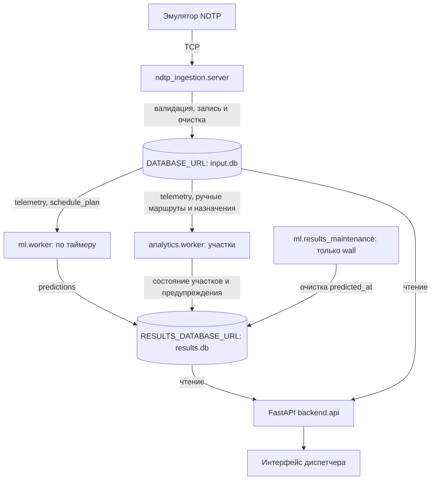

# Delay Prediction Platform

Прогноз задержки автобусов на остановке через 10–15 минут. Модель ДС объединяет бустинги и PyTorch GRU; при ошибке модели работает baseline. Backend показывает готовые прогнозы, не запускает модель по запросу интерфейса.

## Схема



Обработчик `ndtp_ingestion.server` принимает TCP-пакеты эмулятора и пишет в SQLite-базу входных данных. ML worker рассчитывает прогнозы по таймеру; API читает телеметрию и готовые прогнозы. Модель не запускается по HTTP-запросу интерфейса. Детали приёмника, карта устройств и очистка — в [ndtp_ingestion/README.md](ndtp_ingestion/README.md).

## Первый запуск после клонирования

Нужны Python **3.12** с `venv`, работающий Docker и несколько гигабайт свободного места. На Linux также нужна библиотека OpenMP (`libgomp1` в Debian/Ubuntu). Архив эмулятора `ndtp-telemetry-emulator.tar` получите из исходной раздачи и положите в `data/dataset/`: в Git его нет. Веса ML-моделей уже включены в репозиторий, обучение не требуется.

```bash
git clone https://github.com/valentinesvev/delay_prediction_platform.git
cd delay_prediction_platform
python3.12 -m venv .venv
bash scripts/setup_and_run.sh --install --mode emulator --demo-plan
```

Первая установка скачивает зависимости и может занять значительное время. Если `.venv` уже настроена, повторно создавать её и передавать `--install` не нужно — используйте команду ниже. Docker должен быть доступен текущему пользователю без запуска всего приложения через `sudo`.

## Быстрый запуск в существующем окружении

Проверенная конфигурация: Linux, Python **3.12**, существующая `.venv`. Скрипт проверяет зависимости, но по умолчанию ничего не скачивает. `.env` автоматически не загружается.

```bash
# Живой TCP-поток от эмулятора, искусственный план для проверки интеграции:
bash scripts/setup_and_run.sh --mode emulator --demo-plan
```

Откройте **http://127.0.0.1:8000/**. На экране: ТС со свежей телеметрией, состояние относительно плана, скорость, оценка текущей задержки, ближайшая/следующая остановка, прогноз и остановка прогноза. Данные обновляются каждые 5 с; ML в этом режиме — каждые 10 с (переопределяется `ML_INTERVAL_S`). Отсутствующий прогноз не скрывает ТС.

Нужен работающий Docker, доступный текущему пользователю, и образ `ndtp-telemetry-emulator:1.0` либо локальный `data/dataset/ndtp-telemetry-emulator.tar`. Скрипт сам загрузит архив при необходимости. Используются порты 8000, 9000 и 18080. Автоматическое управление контейнером поддержано на Linux; для внешнего эмулятора есть `--no-emulator`. Остановка — Ctrl+C.

**Демонстрационное расписание искусственное, движение эмулятора случайное.** Оно нужно для проверки потока данных, а не оценки точности модели. Историческая телеметрия в режиме emulator не импортируется; файлы баз сохраняются между запусками, CSV повторно не загружается. Чтобы получить новый искусственный план после его устаревания, укажите новый файл `--db`. Для настоящего расписания:

```bash
bash scripts/setup_and_run.sh --mode emulator \
  --schedule /path/to/current-plan.csv \
  --unit-map /path/to/units.json \
  --emulator-config /path/to/emulator.json
```

Карта устройств — JSON `unit_id → tr_id`, план — актуальные времена UTC и координаты. Идентификаторы нельзя приравнивать без карты. Настройки, формат CSV и пример конфигурации — в [инструкции обработчика](ndtp_ingestion/README.md).

```bash
# Историческая проверка ML: загрузить CSV только при отсутствии artifacts/input.db:
bash scripts/setup_and_run.sh --mode historical
# Тесты перед запуском (без переустановки):
bash scripts/setup_and_run.sh --mode emulator --demo-plan --test
# Установить отсутствующие пакеты — только по явному запросу, нужен интернет:
bash scripts/setup_and_run.sh --install --mode historical
# Все параметры:
bash scripts/setup_and_run.sh --help
```

Оценка текущей задержки строится по GPS и плану, а не передаётся эмулятором. При недостатке данных показывается «—». «На линии по плану» — состояние по доступной телеметрии/плану, не подтверждение выпуска диспетчером. Номера маршрутов в текущем контракте нет; показывается ID ТС. Остановка отображается по адресу из плана либо ID.

Приёмник очищает только входную базу: телеметрия хранится 2 часа по времени получения, прошедшие строки плана — 6 часов по плановому времени. Отдельный процесс `ml.results_maintenance` удаляет прогнозы старше суток по `predicted_at`; период задаёт `RESULTS_CLEANUP_INTERVAL_S` (600), срок — `PREDICTIONS_RETENTION_S` (86400). Сроки настраиваются в `.env.example` и передаются переменными окружения. Исторический режим приёмник и очистку не запускает.

Старое тестовое демо с отдельными `backend/prediction_worker.py`, `data/ingestion.py`, `data/storage.py` и `ml/pipeline.py` удалено. Исторический режим выше использует актуальные ML-модели и две базы, поэтому сохраняется как самостоятельная проверка без эмулятора.

Если HTTP-порт занят, добавьте `--port 8002` и откройте `http://127.0.0.1:8002/`. Порты приёмника и REST эмулятора задаются через `NDTP_PORT` и `EMULATOR_API_PORT`. Для своего конфига эмулятора `targetPort` должен совпадать с `NDTP_PORT`. При запуске с `--demo-plan` конфиг формируется автоматически.

## Локальный запуск на исторических данных

Ручная альтернатива скрипту, из корня репозитория, Python 3.12:

```bash
python -m venv .venv
source .venv/bin/activate
# Linux: CPU-версия PyTorch без загрузки CUDA-зависимостей.
if [ "$(uname)" = "Linux" ]; then
  python -m pip install torch --index-url https://download.pytorch.org/whl/cpu
fi
python -m pip install -r requirements.txt
mkdir -p artifacts
[ -f artifacts/input.db ] || python -m ml.csv_to_db --data data/dataset --url sqlite:///artifacts/input.db
export DATABASE_URL=sqlite:///artifacts/input.db
export RESULTS_DATABASE_URL=sqlite:///artifacts/results.db
export ML_TIME_MODE=stream
python -m ml.results_db
python scripts/run_demo.py
```

На Windows активируйте виртуальное окружение своей командой, затем задайте `DATABASE_URL`, `RESULTS_DATABASE_URL` и `ML_TIME_MODE` средствами вашей оболочки. Откройте `http://127.0.0.1:8000/`, API доступен в `/docs`. `ml.csv_to_db` **заменяет** таблицы `telemetry` и `schedule_plan` по переданному URL; не запускайте повторную загрузку в базу с нужной вам живой историей. Файл `artifacts/input.db` не коммитится.
На macOS обычная установка `requirements.txt` установит сборку PyTorch для macOS. Для первого запуска потребуются загрузка библиотек и несколько гигабайт свободного места.

Для одного цикла без постоянного процесса:

```bash
python -m ml.worker --once
```

Для живого потока установите `ML_TIME_MODE=wall` и подайте во входную базу свежую валидированную телеметрию и актуальный план. Без этих таблиц worker не сможет рассчитать прогноз. `ML_INTERVAL_S` (по умолчанию 30 секунд) задаёт интервал расчётов, `PREDICTION_MAX_AGE_SECONDS` (90 секунд) — порог свежести API. Образец настроек — `.env.example`; этот файл автоматически не загружается. Имена таблиц/полей для ML настраиваются в `ml.db.DBConfig`.

## HTTP API бэкенда

- `GET /vehicles/active` — ТС с телеметрией не старше 120 с, текущая оценка задержки, остановки и готовый прогноз. В `stream` время отсчитывается от последней исторической точки, в `wall` — от текущего UTC.
- `GET /health` — жив ли HTTP-процесс; это не проверка модели и базы.
- `GET /predictions/latest` — список последних сохранённых прогнозов, по одному на `tr_id`. Пока записей нет: `{"status":"unavailable","predictions":[]}`; если все записи устарели, общий статус — `stale`.
- `GET /predictions/{tr_id}/latest` — последняя запись одного ТС; 404, если её нет.
- `GET /analytics/segments` — последнее рассчитанное состояние каждого вручную заданного участка.
- `GET /analytics/alerts` — активные предупреждения по участкам.

Ответ содержит `t_forecast`, `predicted_at`, `target_stop_id`, `target_time_plan`, `predicted_delay_s`, `predicted_arrival`, `interval_lo_s`, `interval_hi_s`, `model_used`, `fallback_reason`, `degraded` и `status` (`ready`/`stale`). Времена API представлены ISO 8601 UTC; свежесть определяется по более старому из `t_forecast` и `predicted_at`. При недоступности настроенной БД API возвращает 503. Исторические прогнозы в режиме реплея закономерно отображаются как `stale`.

Отдельный `ml.service` на порту 8001 предоставляет `POST /predict`, `POST /predict/batch` для ручной проверки модели без БД и `POST /predict/from-db` для принудительного цикла (параметр `write=false` отключает запись). Постоянный цикл выполняет `ml.worker`; бэкенд напрямую к `ml.service` не обращается. Подробности модели и метрики — в [README_ML.md](README_ML.md).

## Работа в команде

Работайте в отдельной ветке. Перед началом обновите `main`, затем подтяните его изменения в свою ветку; изменения отправляйте через Pull Request:

```bash
git switch main
git pull
git switch -c feature/название
# после изменений
git add .
git commit -m "Описание изменений"
git push -u origin feature/название
```

Если ветка уже создана, вместо `git switch -c` используйте `git switch feature/название` и `git merge main`. Новые библиотеки вносите в `requirements-ml.txt` (ML/рабочий запуск) или `requirements.txt` (инструменты проверки).

Тесты: `python -m pytest -q`. Дополнительно см. [backend/README.md](backend/README.md).


## Диспетчерский экран с картой

Для аналитики участков теперь есть отдельный процесс, который читает входную базу и пишет готовые метрики во вторую базу. Как задать маршрут, назначить автобусы и запустить расчёт, описано в [analytics/README.md](analytics/README.md). Блок «Где движение замедляется» обращается к `/analytics/segments` и `/analytics/alerts`. Если аналитика ещё не подготовлена, основная карта транспорта продолжает работать.

Инструкция фронтендеру, контракт API и порядок добавления новых запросов — [frontend/README.md](frontend/README.md).

Основной экран — **http://127.0.0.1:8000/**. Старый табличный интерфейс удалён. Адреса `/dispatcher` и `/dispatcher/` перенаправляют на главную страницу.

```bash
bash scripts/setup_and_run.sh --mode emulator --demo-plan
```

Интерфейс раз в 5 секунд обращается к **`GET /vehicles/active`**. FastAPI читает общую БД: последние достоверные координаты и треки из `telemetry`, остановки из `schedule_plan`, готовые ML-прогнозы из `predictions`. HTTP-запрос не запускает модель и не записывает данные в БД. Прогноз рассчитывает отдельный воркер. Статическая запись `replay.json` больше не используется, `/dispatcher/replay` удалён.

Карта и карточки показывают ID ТС, GPS за последние 10 минут, ближайшие/следующие точки расписания, оценку текущей задержки по GPS, прогноз задержки и прибытия, интервал, модель и свежесть расчёта. Разрывы GPS более 90 с и невалидные точки не соединяются линиями. В `position`, точках `track`, остановках `stops` и `prediction.target_position` координаты идут как **[latitude, longitude]**. Времена API — ISO UTC, отображение — московское время.

Красный сигнал означает, что текущая оценка задержки достигла выбранного порога; жёлтый — что порога достиг свежий прогноз. Вероятности пробок, причины задержки и поломки не выдумываются. Устаревший прогноз показывается справочно с пометкой, baseline и неполная телеметрия обозначаются отдельно. ТС без прогноза видны в фильтре «Все», выбранном по умолчанию. ТС без достоверной точки за последние 120 с исключаются после обновления.

Сохранены поиск, условные географические зоны, пороги 2/5/10 минут, выбор транспорта и слоёв, переключение подложки и разворачивание карты. Встроенные демонстрационные сценарии и проигрывание статической записи убраны. При ошибке API последние данные остаются с предупреждением, запросы не накладываются, таймаут — 10 секунд. Для картографических библиотек и подложек нужен интернет; при недоступной карте список продолжает работать.

Исторический режим `--mode historical` использует ту же карту и API, но показывает состояние на время последней телеметрии из базы. Режим и искусственное расписание `--demo-plan` явно отмечаются над картой. Файлы независимого макета `Frontend Test` сохранены как исходный материал и не обслуживаются приложением.

Проверки: `python -m pytest -q`, а для логики клиента (Node.js 22+, без npm-зависимостей) — `node --test tests/dispatcher-data.test.cjs tests/dispatcher-ui.test.cjs`.


## Две базы: запуск и перенос

`setup.py` использует `artifacts/input.db` (historical) либо `artifacts/live-input.db`
(emulator), а для результатов — `artifacts/results.db` либо `artifacts/live-results.db`
соответственно. Это отделяет исторические результаты от живой очистки. Пути переопределяются
`--db` и `--results-db`; они должны различаться. `run_demo.py` использует адреса
из окружения, проверяет входные таблицы и выполняет идемпотентную инициализацию
результатов **до** запуска worker и API. Без `RESULTS_DATABASE_URL` старые команды
продолжают работать с одной базой. Приёмник и в этом режиме не создаёт и не очищает
`predictions`: за неё отвечают инициализация/ML и отдельное обслуживание.

Порядок отдельного запуска процессов после подготовки входных данных:

```bash
export DATABASE_URL=sqlite:///artifacts/input.db
export RESULTS_DATABASE_URL=sqlite:///artifacts/results.db
export ML_TIME_MODE=stream  # wall для живого потока
python -m ml.results_db
# В отдельных терминалах с теми же переменными:
python -m ml.worker
python -m uvicorn backend.api:app --host 127.0.0.1 --port 8000
# Только в живом режиме:
python -m ml.results_maintenance
# Приёмник требует NDTP_UNIT_MAP; создаёт только входные таблицы:
python -m ndtp_ingestion.server
```

Инициализация создаёт `predictions`, уникальность `(tr_id, t_forecast, target_stop_id)`
и индексы, включая `predicted_at`, без удаления записей. Worker и ручной
`POST /predict/from-db` используют одинаковое разделение баз. API соединяет данные
по `tr_id` в Python; JSON интерфейса сохранён. При отсутствии файла/таблицы или
ошибке доступа настроенной базы результатов API возвращает HTTP 503, не создавая
файл. Worker логирует ошибку и повторяет цикл с задержкой до 60 секунд.
`/health` проверяет только HTTP-процесс. В режиме `stream` обслуживание результатов
не удаляет записи даже при ручном запуске; ML никогда не выполняет очистку.

Для переноса старой общей базы:

1. Остановите worker, приёмник, API и обслуживание. Сделайте резервную копию через
   SQLite backup (например, `sqlite3 artifacts/demo.db '.backup artifacts/demo-backup.db'`);
   обычное копирование одного `.db` при активном WAL недостаточно.
2. Сохраните старую базу как входную; не запускайте повторный CSV-импорт.
3. Выполните:

```bash
export DATABASE_URL=sqlite:///artifacts/demo.db
export RESULTS_DATABASE_URL=sqlite:///artifacts/results.db
export ML_TIME_MODE=stream
python -m ml.results_db
python -m ml.migrate_predictions --source sqlite:///artifacts/demo.db
python scripts/run_demo.py
```

Перенос читает источник только для чтения, копирует прогнозы одной транзакцией и
проверяет все поля каждой строки по уникальному ключу. `id` назначается в целевой
базе заново. Команда выводит `source_rows_verified` и `inserted`; повторный запуск
должен показать `inserted: 0`. При различающихся данных одного ключа перенос
откатывается с ошибкой, ничего не перезаписывает. Старые `predictions` остаются
в исходной базе и автоматически не удаляются. Для отката остановите процессы и
уберите `RESULTS_DATABASE_URL` (новые прогнозы из отдельной базы назад автоматически
не переносятся). Для большой истории учитывайте, что перенос читает её в память.
