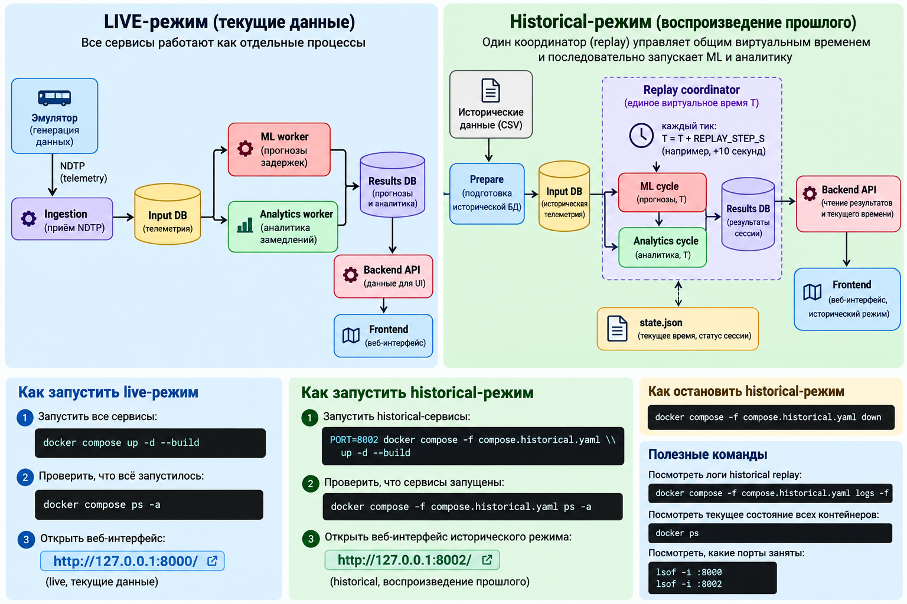

# Запуск проекта

## 1. Клонировать проект

```bash
git clone <URL_РЕПОЗИТОРИЯ>
cd delay_prediction_platform
```

## 2. Live-режим — первый запуск

Положить эмулятор сюда:

```text
data/dataset/ndtp-telemetry-emulator.tar
```

Один раз загрузить образ:

```bash
docker load -i data/dataset/ndtp-telemetry-emulator.tar
```

Запустить:

```bash
docker compose up -d --build
```

Открыть:

```text
http://127.0.0.1:8000/
```

Проверить:

```bash
docker compose ps -a
```

Остановить:

```bash
docker compose down
```

## 3. Historical-режим

Эмулятор не нужен.

Запустить:

```bash
PORT=8002 docker compose -f compose.historical.yaml up -d --build
```

Открыть:

```text
http://127.0.0.1:8002/
```

Проверить:

```bash
docker compose -f compose.historical.yaml ps -a
```

Посмотреть ход replay:

```bash
docker compose -f compose.historical.yaml logs -f replay
```

Остановить:

```bash
docker compose -f compose.historical.yaml down
```

После первого `docker load` для live-режима архив каждый раз загружать не нужно: Docker уже хранит образ `ndtp-telemetry-emulator:1.0` локально.


# Как пользоваться интерфейсом диспетчера

Карта и список. Найдите автобус на карте или в списке слева. Можно воспользоваться поиском по ID автобуса или адресу остановки. Нажмите на автобус, чтобы открыть подробности.

Цвета участков: красный — текущая задержка достигла порога; жёлтый — прогнозируется задержка; зелёный — оценка ниже порога; серый — недостаточно данных. Порог можно выбрать: 2, 5 или 10 минут.

Карточка автобуса. Показывает текущую задержку, следующую или ближайшую остановку, а при наличии свежего прогноза — ожидаемое опоздание и время прибытия. Текущая задержка оценивается по GPS и расписанию.

Карточка инцидента. Показывает проблемный участок и величину задержки. Нажмите на неё, чтобы приблизить участок на карте. Причина задержки пока не определяется.

Линии на карте. Сплошная линия показывает записанный GPS-путь. Пунктир соединяет остановки схематично и не обязательно совпадает с дорогой.

Обновление данных. Данные обновляются автоматически примерно каждые 5 секунд. Устаревшие прогнозы скрываются. Если прогноза нет, это не означает, что автобус идёт по расписанию.

(В историческом режиме отображается выбранный момент записи, а не текущая обстановка. Воспроизведение можно начать сначала или с выбранного времени)

# Архитектура




# Производительность:

В лог добавлена статистика циклов
Сводка по последним 100 попыткам цикла (накопите 100 циклов):

Для потокового режима:
```bash
docker compose logs --no-color --no-log-prefix worker | python -m scripts.worker_stats --last 100
```
Для исторического:
```bash
docker compose -f compose.historical.yaml logs --no-color --no-log-prefix replay | python3 -m scripts.worker_stats --last 100
```
Основные поля:

cycle_ms_avg/max — длительность полного шага до публикации результатов;
ml_ms_avg, analytics_ms_avg — среднее время этапов;
cycles_over_step — сколько шагов обрабатывались дольше шага времени потока.

## Документация

- [Код — Sphinx](docs/README.md)
- [API — OpenAPI / Swagger](docs/API.md)

